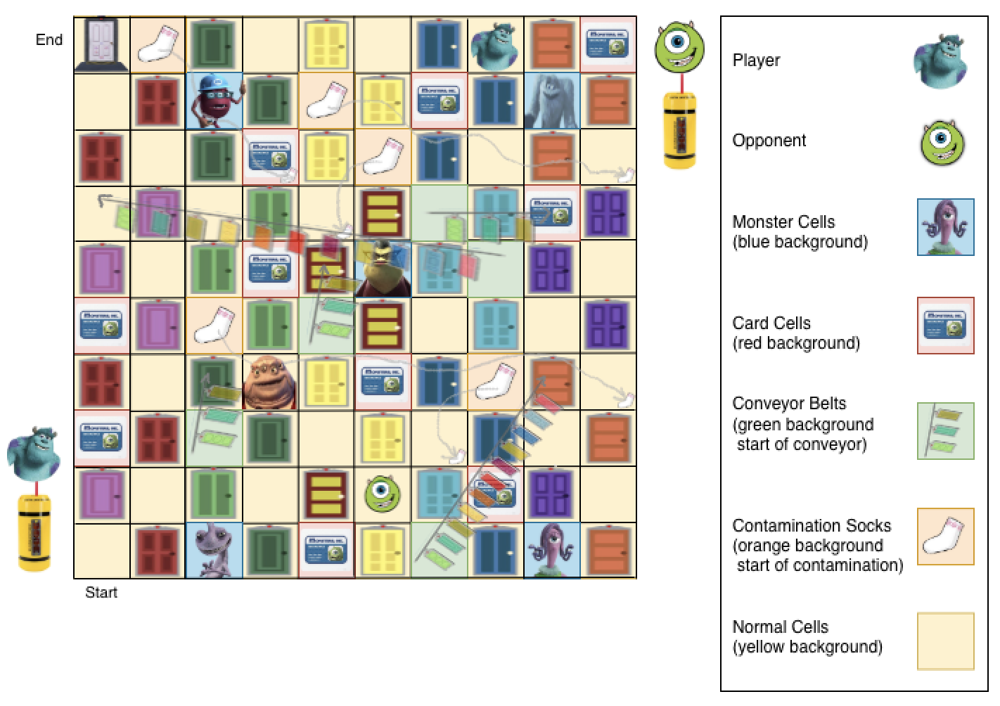
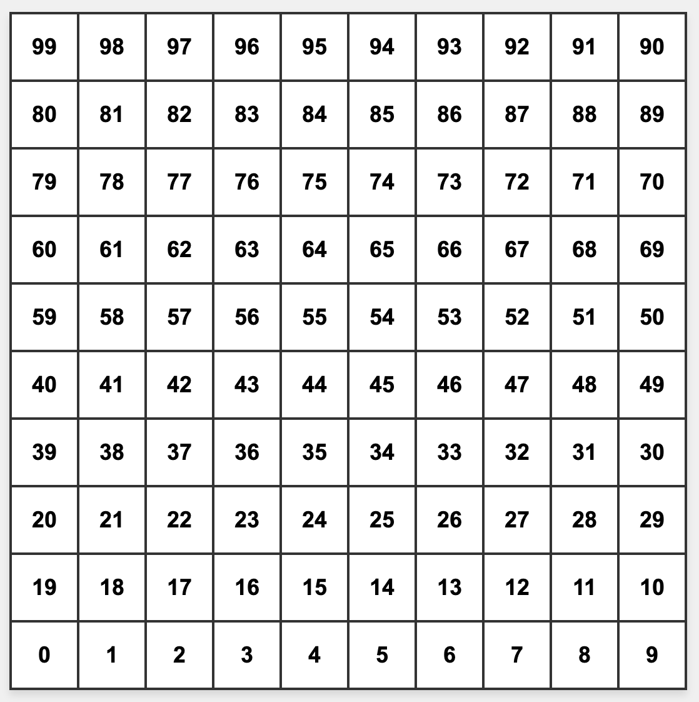
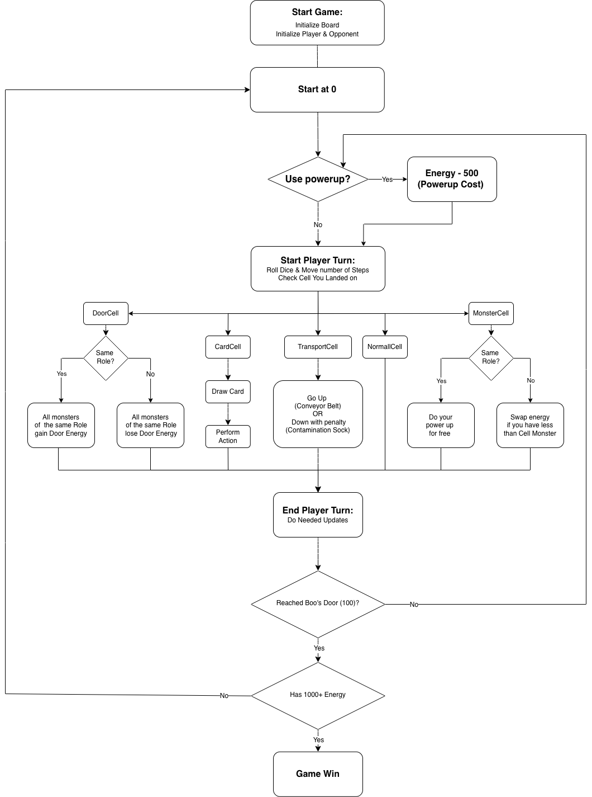

# 🚪 DooR DasH: Scare vs Laugh Touchdown

> *"We scare because we care." – or – "We laugh, that's our path."*

A competitive board game set in the world of **Monsters Inc.**, where two monsters race across the Floor to collect energy and reach Boo's Door first.

---

## 📖 Introduction

**DooR DasH** pits Scarers against Laughers in a strategic race across a 100-cell board. For generations, Monstropolis was powered by screams — but Mike Wazowski discovered that **laughter produces ten times more energy**. Now both methods compete for supremacy.

**Goal:** Be the first monster to reach **Boo's Door (cell 99)** with at least **1,000 energy**.

---

## 🎮 Game Setup

*The Floor — a 100-cell zigzag grid*

*Cell type legend*

### Board Layout

The board is a **10×10 zigzag grid** (like Snakes & Ladders) numbered 0–99:

| Row | Direction | Cells |
|-----|-----------|-------|
| Bottom | → | 0–9 |
| Row 2 | ← | 19–10 |
| Row 3 | → | 20–29 |
| ... | zigzag | ... |
| Top | ← | 99–90 |

### Cell Types

| Cell Type | Count | Description |
|-----------|-------|-------------|
| 🚪 Door Cells | 50 (25 Scarer / 25 Laugher) | Odd-numbered cells; collect or lose energy |
| 👾 Monster Cells | 6 | House inactive monsters; trigger free powerups |
| ⚡ Conveyor Belts | 5 | Move monster **forward** (positive transport) |
| 🧦 Contamination Socks | 5 | Move monster **backward** + drain 100 energy |
| 🃏 Card Cells | 10 | Draw a random card from the pile |
| 🟡 Normal Cells | 24 | No effect |

---

## 🃏 Cards

There are **25 cards** total, shuffled at game start. When depleted, they are reshuffled.

| Card Name | Type | Count | Effect |
|-----------|------|-------|--------|
| Position Swap | Swapper | 4 | Swap places with opponent (only if player is behind) |
| Contamination Code | Start Over | 2 | **Player** returns to cell 0 |
| 2319 Alert | Start Over | 3 | **Opponent** returns to cell 0 |
| Small Snatcher | Energy Steal | 3 | Steal 50 energy from opponent |
| Sneaky Thief | Energy Steal | 2 | Steal 100 energy from opponent |
| Mega Drain | Energy Steal | 1 | Steal 150 energy from opponent |
| Super Shield | Shield | 5 | Block the next negative energy effect for your team |
| Mind Scramble | Confusion | 3 | Both players swap roles for **2 turns** |
| Total Confusion | Confusion | 2 | Both players swap roles for **3 turns** |

> **Shield note:** Only one shield exists. If the opponent holds it, it's removed before the new player receives it. Shields do **not** block a Schemer's steal powerup.

---

## 👹 Monsters

Each monster belongs to a **Type** that determines their passive trait and active powerup.

### Monster Types

#### ⚡ Dasher
- **Passive — Lightning Movement:** Base dice roll is **doubled** (2× speed)
- **Powerup — Momentum Rush:** Move at **3× speed** for 3 turns (costs 500 energy, or free on matching Monster Cell)

#### 💥 Dynamo
- **Passive — Energy Amplification:** All energy **gains and losses are doubled**
- **Powerup — Energy Freeze:** Opponent skips their **entire next turn**

#### 🔄 Multitasker
- **Passive — Movement & Energy:** Dice movement is **halved**, but all energy changes get a **+200 bonus**
- **Powerup — Focus Mode:** Move at **normal speed** (not halved) for 2 turns

#### 🎭 Schemer
- **Passive — Energy Manipulation:** All energy changes gain a **+10 bonus** (gains increase, losses decrease)
- **Powerup — Chain Attack:** Steal **10 energy from every other monster** on the board (ignores shields)

### Monster Roster

| Monster | Type | Team | Personality | Starting Energy |
|---------|------|------|-------------|-----------------|
| James P. Sullivan | Dynamo | ⚡ SCARER | The top scarer — powerful and confident | 300 |
| Mike Wazowski | Dasher | 😂 LAUGHER | Fast and funny — the comedy speedster | 100 |
| Randall Boggs | Schemer | ⚡ SCARER | Sneaky and cunning — always has an angle | 20 |
| Celia Mae | Multitasker | 😂 LAUGHER | Organized receptionist — handles everything | 50 |
| Roz | Multitasker | ⚡ SCARER | Always watching — nothing escapes her notice | 100 |
| Fungus | Dasher | 😂 LAUGHER | Timid assistant — quick but nervous | 50 |
| Henry J. Waternoose | Schemer | ⚡ SCARER | Witty and strategic CEO | 70 |
| Yeti | Dynamo | 😂 LAUGHER | Banished snow monster — surprisingly cheerful | 100 |

---

## 🔧 Game Initialization

### Step 1 — Choose Your Side
- Player selects **SCARER** or **LAUGHER**
- The game randomly assigns one monster of each role

### Step 2 — The Floor Activates
- Both monsters start at **cell 0**
- The 6 remaining (unselected) monsters are placed at the 6 Monster Cells
- 25 cards are shuffled into a draw pile

### Step 3 — The Competitors Assemble
- Active monsters: **Player** and **Opponent**
- Inactive monsters: stationed at Monster Cells, available for free powerup triggers

---

## 🎲 Turn Sequence

Each turn follows this strict order:

1. **Powerup Phase** *(optional)* — Spend 500 energy to activate your powerup
2. **Dice Roll** — Roll a standard 6-sided die (1–6)
3. **Movement** — Move forward by the rolled amount
   - If the destination is **occupied by the opponent**, the move is **invalid** — re-roll
4. **Cell Action** — Resolve the effect of the landed cell
5. **Board Update** — Finalize all state changes
6. **Turn Switch** — Pass turn to the other player (unless win condition is met)

---

## 🏆 Win Condition

A player wins when **both** conditions are met:

- ✅ Position is exactly **cell 99** (Boo's Door)
- ✅ Energy is **≥ 1,000**

If only one condition is met, the game continues.

---

## 📊 Game Flow

*Complete turn decision flowchart*

---

## 📋 Cell Interaction Reference

### Door Cells
| Scenario | Effect |
|----------|--------|
| Role **matches** door | Landing monster + entire team **gain** door energy |
| Role **mismatches** door | Landing monster + entire team **lose** door energy (blockable by shield) |
| Shield active on mismatch | Energy loss blocked; door remains **unactivated** |
| Door already activated | No energy effect (one-time use) |

### Monster Cells
| Scenario | Effect |
|----------|--------|
| Same role as cell monster | Trigger your **powerup for free** |
| Different role, you have more energy | **Swap energies** with cell monster |
| Different role, you have less energy | No effect |

### Transport Cells
| Type | Effect |
|------|--------|
| Conveyor Belt | Teleport **forward** (no effect on landing cell) |
| Contamination Sock | Teleport **backward** + lose **100 energy** (shield blocks energy loss, not movement) |

---

## ⚠️ Disclaimer

This is a **fan-made, non-commercial board game** created for educational and entertainment purposes only.

**DooR DasH: Scare vs Laugh Touchdown** is not affiliated with, endorsed by, or connected to Pixar Animation Studios or The Walt Disney Company in any way.

All Monsters Inc. characters, names, imagery, and related intellectual property are trademarks and © of **Pixar Animation Studios / The Walt Disney Company**. All rights reserved.

No copyright infringement is intended. This project is not for sale and no profit is being made from it.
